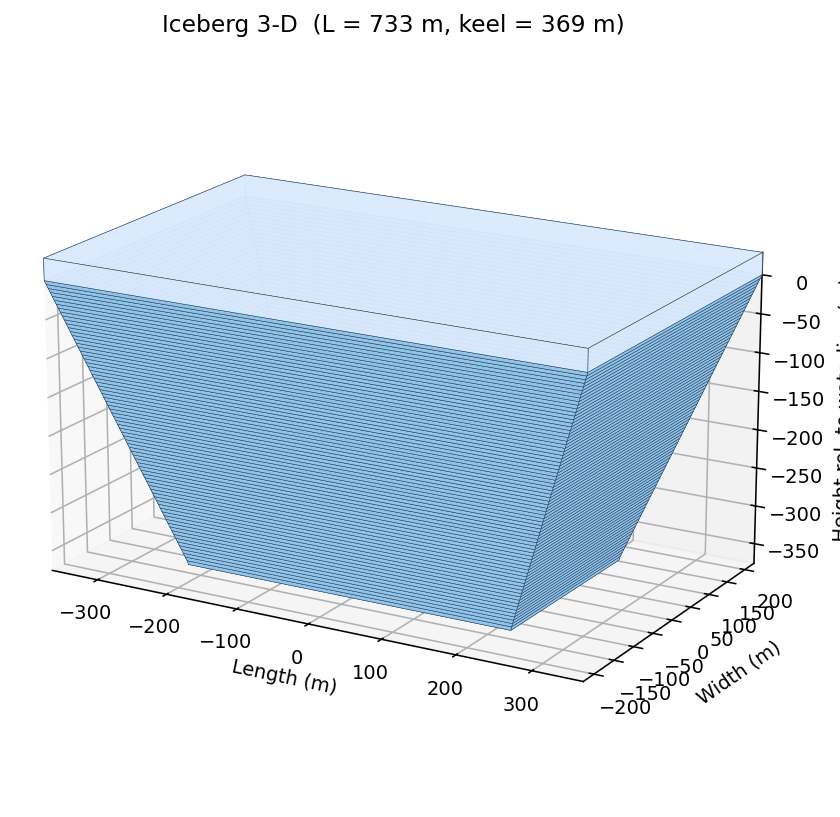
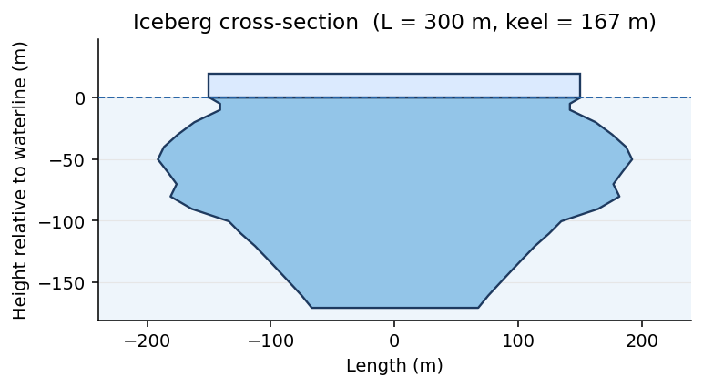

# iceberg-geometry

A Python model for **iceberg geometry and stability**. From a single input — the
waterline length — it builds an iceberg's full above- and below-water shape:
keel depth, per-depth cross-sections, volumes, freeboard, and a hydrostatic
stability check.

The model is based on Moon et al. (2018), using the empirical shape relationships
of Barker et al. (2004), the stability criterion of Wagner et al. (2014), and the
L:W ratio of Dowdeswell et al. (1992). It also includes an optional calibration to
deep-keeled Sermilik Fjord icebergs from Schild et al. (2021) and Sulak et al.
(2017) — see [Sermilik calibration](#sermilik-calibration).

## Installation

Clone the repo and install in editable mode (so code edits take effect immediately):

```bash
git clone https://github.com/shahinmg/iceberg_geometry.git
cd iceberg_geometry
pip install -e .
```

Requires Python ≥ 3.10 (numpy, scipy, xarray, scikit-learn, matplotlib).

## Quick start

```python
from iceberg_geometry import Iceberg

# create an iceberg from its waterline length (metres); dz is the vertical
# layer thickness for the depth discretisation
berg = Iceberg(length=300, dz=5)

# keel depth from an empirical relationship
berg.keeldepth(method='barker')          # -> 167.0 m

# full geometry: an xarray.Dataset of the whole iceberg
ice = berg.init_iceberg_size()
print(ice.keel.values, ice.freeB.values, ice.totalV.values)
# 167.0   18.7   9.94e+06
```

`init_iceberg_size()` applies the Wagner (2014) stability criterion (W/H ≥ 0.92)
and widens the iceberg if needed to keep it stable.

## The output dataset

`init_iceberg_size()` returns an `xarray.Dataset`. Every variable carries
`long_name`/`units` metadata (hover the variable in a notebook, or `ice.keel.attrs`):

| Variable | Meaning | Units |
|---|---|---|
| `Z` (coord) | depth below waterline (positive down) | m |
| `cross_area`, `uwL`, `uwW`, `uwV` | per-depth cross-section area, length, width, volume | m², m, m, m³ |
| `keel` | keel depth | m |
| `freeB` | freeboard (height above waterline) | m |
| `L`, `W` | waterline length and width | m |
| `totalV`, `sailV` | total and above-water (sail) volume | m³ |
| `TH` | total thickness (keel + freeboard) | m |
| `dz`, `dzk`, `keeli` | layer thickness, keel partial layer, deepest layer index | m, m, – |

Save it like any xarray dataset — the metadata is written into the file:

```python
ice.to_netcdf("iceberg.nc")
```

## Keel-depth methods

`keeldepth(method=...)` and `init_iceberg_size(keel_method=...)` accept:

| method | relationship | notes |
|---|---|---|
| `'barker'` *(default)* | `K = 2.91·L^0.71` | Barker et al. 2004 |
| `'hotzel'` | `K = 3.78·L^0.63` | Hotzel |
| `'constant'` | `K = 0.7·L` | simple proportional |
| `'schild'` | `K = L / 1.98` | Sermilik large-iceberg (~2:1); see below |
| `'mean'` | average of the above | hybrid |

## Sermilik calibration

Two options recalibrate the model to deep-keeled Sermilik Fjord icebergs and other similar fjord systems
(Schild et al. 2021; Sulak et al. 2017), valid for **large icebergs (L ≳ 400 m)**:

- `keel_method='schild'` — deeper keel via the measured ~2:1 length-to-keel ratio.
- `volume_law='sulak'` — corrects the tabular volume overestimate using the
  `V ∝ A^1.31` footprint-area–to-volume relation, tapering the keel to match.

```python
# a large iceberg with the Sermilik calibration applied
berg = Iceberg(length=733, dz=5)
ice = berg.init_iceberg_size(keel_method='schild', volume_law='sulak')

berg.keeldepth('barker')   # 314 m  (uncalibrated)
berg.keeldepth('schild')   # 369 m  (calibrated, measured 386 m)
```

## Visualisation

```python
berg = Iceberg(length=733, dz=5)
ice = berg.init_iceberg_size(keel_method='schild', volume_law='sulak')

berg.plot_iceberg_shape(ice=ice)   # 2-D cross-section (waterline, sail, keel)
berg.plot_iceberg_3d(ice=ice)      # 3-D solid
```



*`plot_iceberg_3d` output for a calibrated 733 m iceberg (keel 369 m): sail above the waterline, tapering keel below.*

For a smaller, uncalibrated iceberg the natural Barker taper shows in the 2-D section:

```python
berg = Iceberg(length=300, dz=5)
ice = berg.init_iceberg_size()          # default (Barker) model
berg.plot_iceberg_shape(ice=ice)        # 2-D cross-section
```



*`plot_iceberg_shape` for a default 300 m iceberg (keel 167 m, freeboard 19 m).*

Both methods take a pre-computed `ice` dataset (pass `ice=...`), or compute a
default one internally if omitted. They return `(fig, ax)`:

```python
fig, ax = berg.plot_iceberg_3d(ice=ice, elev=18, azim=-60)
fig.savefig("iceberg_3d.png", dpi=150, bbox_inches="tight")
```

In a notebook use `%matplotlib inline` for static plots, or `%matplotlib widget`
to rotate the 3-D view. `plot_iceberg_shape` also takes `dimension='width'` for a
width-section instead of the default length-section.

## Citation

```python
from iceberg_geometry import Iceberg
Iceberg.citation()   # dict of the model's key references
```

**References**
- Moon, T., et al. (2018). Subsurface iceberg melt key to Greenland fjord freshwater budget. *Nature Geoscience*, 11(1), 49–54.
- Barker, A., et al. (2004). Determination of iceberg draft, mass and cross-sectional areas. *ISOPE*.
- Wagner, T.J.W., et al. (2014). The 'footloose' mechanism. *Geophysical Research Letters*, 41, 5522–5529.
- Dowdeswell, J.A., et al. (1992). *Journal of Geophysical Research*, 97, 3515–3528.
- Schild, K.M., et al. (2021). *Geophysical Research Letters*, doi:10.1029/2020GL089765.
- Sulak, D.J., et al. (2017). *Annals of Glaciology*, 58(74), 89–98.
